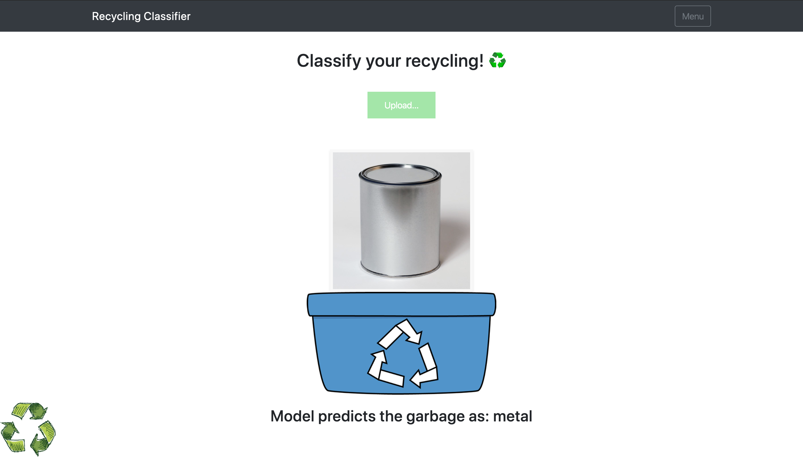
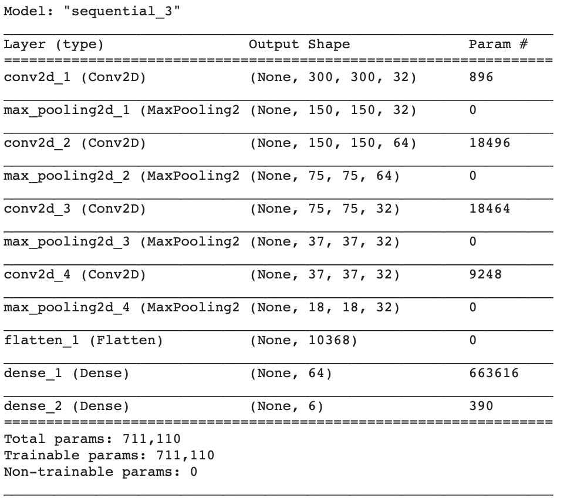
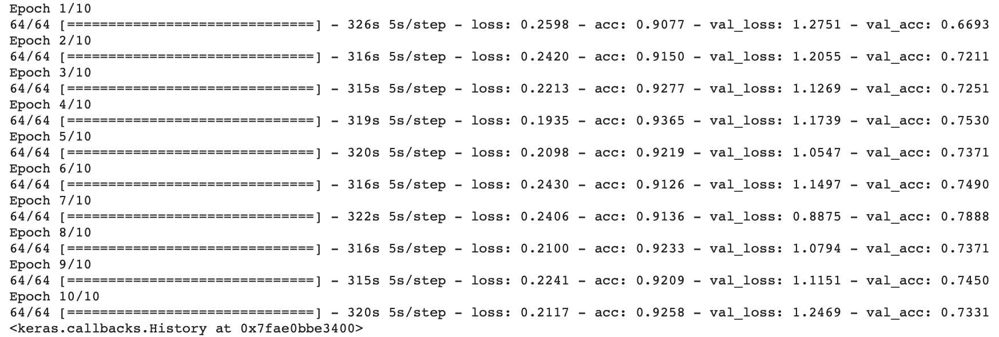
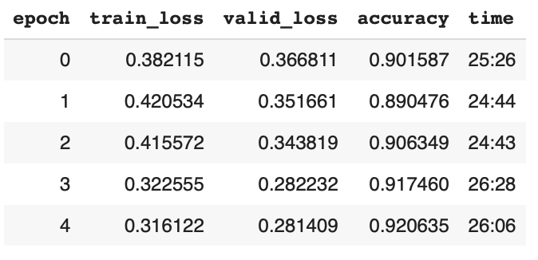
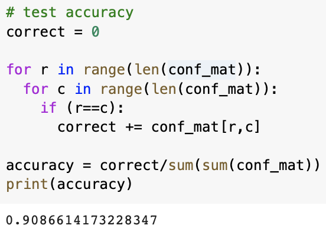
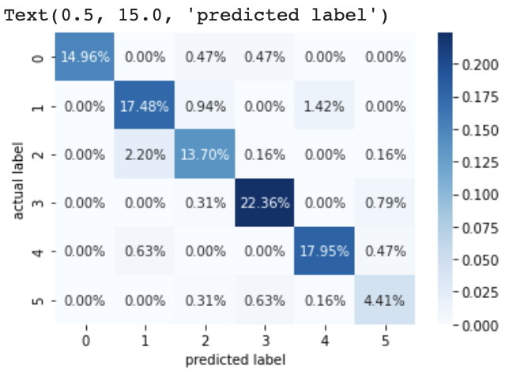
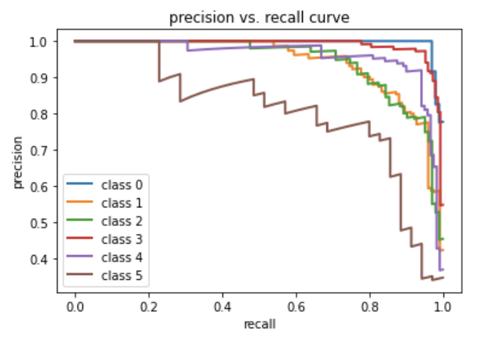
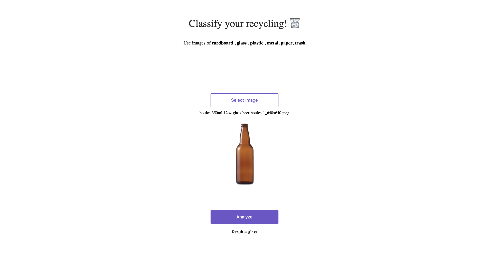
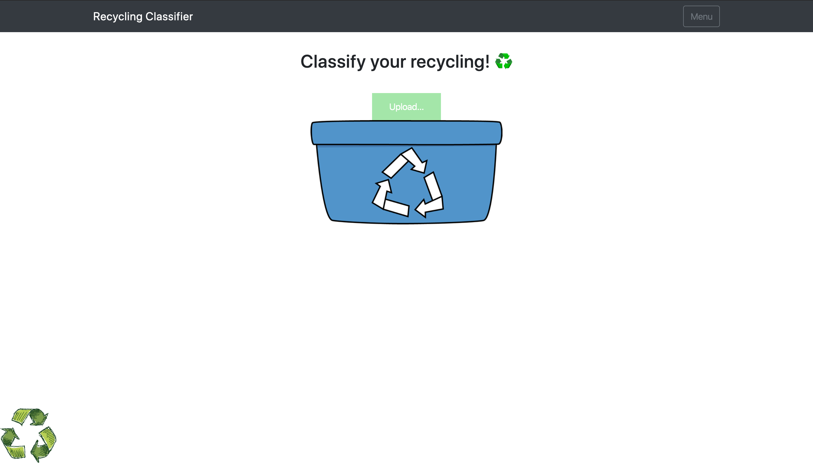
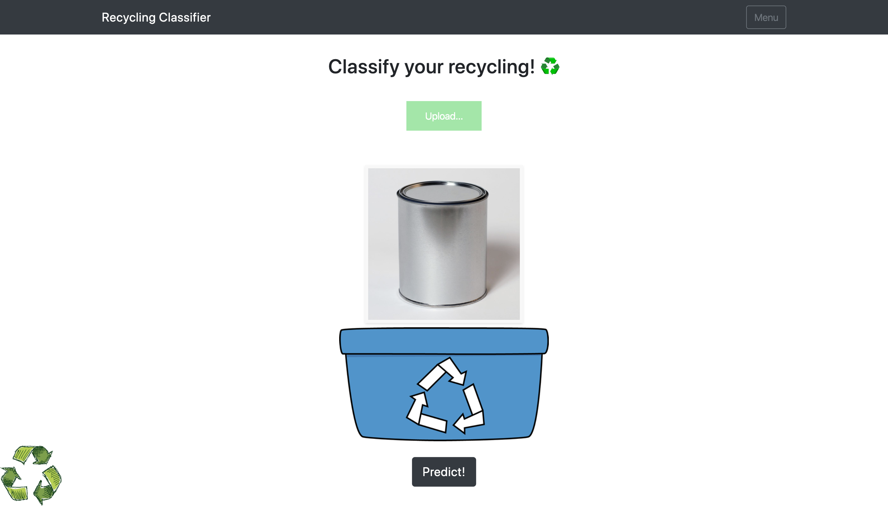

# Garbage Classification 

* Link to application: https://garbage-classification.herokuapp.com
* web application demo:


# 1. Machine-Learning

Training the model was done with google colab.

## Organizing data & Pre-processing

      - data
        - test
        - train
            - cardboard
            - glass
            - metal
            - paper
            - plastic
            - trash
        -valid
            - cardboard
            - glass
            - metal
            - paper
            - plastic
            - trash

* Organized image data from Kaggle (https://www.kaggle.com/asdasdasasdas/garbage-classification) in a file structure like above with 50/25/25 split. 
* View specific code in Garbage-Classification.ipynb [here](https://colab.research.google.com/drive/1lZe5P8orSYYx4OXCNozWqJ1NO9IOF-pF).


Then the data was pre-processed using Fastai library .
```python
from fastai.vision import transform

tfms = get_transforms()
```
* Fastai supports image augmentation on brightness, contrast, crop, crop_pad, dihedral, dihedral_affine, flip_lr, flip_affine, jitter, pad, perspective_warp, resize, rotate, rgb_randomize, skew, squish, symmetric_warp, tilt, zoom, cutout.
* Learn more about it in [this article](https://towardsdatascience.com/introduction-to-image-augmentations-using-the-fastai-library-692dfaa2da42) by Sanyam Bhutani.

Then `ImageDataBunch` was created from the data
```python
# data folder path
path = Path(os.getcwd())/"data"

tfms = get_transforms(do_flip=True, flip_vert=True)
data = ImageDataBunch.fom_folder(path, test="test", ds_tfms=tfms, bs=16)
```
---
## Training model

A few different methods were attempted. 

First, Keras was used to create a model with conv1 layer to conv4 layers. However, the model was not complex enough and it was underfitting. 


* conv4 layer model


* Low validation accuracy compared to training accuracy

So pre-trained model ResNet34 was used with Fastai library.
```python
learn = cnn_learner(data, models.resnet34, metrics=[accuracy])
```
```python
# find learning rate
learn.lr_find(start_lr=1e-6, end_lr=1e1)
learn.recorder.plot(suggestion=True)
```
* Find and pick a right learning rate to train the model

```python
# train model
learn.fit_one_cycle(15, max_lr=1e-03)
```
* Train the model 


* High training accuracy 

The model got test accuracy of about 91%.



### Confusion Matrix



### Precision Recall Curve



# 2. Deploying image classification model

## Setting up Dependency & Virtual environment
* First, there was some trouble trying to install fastai using pip. So Anaconda was used for virtual environment with pip. For some reason, with `pip install` there always occured some sort of CMake error. 
* Use `conda create --name fastai` to create virtual environment named 'fastai' 
* And `conda install -c fastai fastai` to install fastai 

requirements.txt
```txt
fastai==1.0.60
https://download.pytorch.org/whl/cpu/torch-1.4.0%2Bcpu-cp36-cp36m-linux_x86_64.whl
Flask==1.1.2
torchvision==0.5.0
Werkzeug==1.0.1
gunicorn
```
* `https://download.pytorch.org/whl/cpu/torch-1.4.0%2Bcpu-cp36-cp36m-linux_x86_64.whl`. This is cpu only version of Pytorch to reduce size for deployment.
* Install/use appropriate version : https://download.pytorch.org/whl/torch_stable.html.

----
## a. Render

* Render is very simple way to deploy image classification model online. 

* Used [this template](https://github.com/render-examples/fastai-v3) and forked github repository and twicked `server.py` and a javascript file.

* Then the repository was pushed on the github. 

* On Render.com find the repository and create new web service and it's done!


* view full code [here](https://github.com/hoon0624/Garbage-Classification-Render).
----

## b. Heroku

* There is a nice template [here](https://github.com/shankarj67/Water-classifier-fastai) by Shankar Jha.

* Modify `main.js`, `main.css`, `index.html`, `requirements.txt`, model as needed. 

* Initialize the repository, and add, commit push to Heroku Git (`git push heroku master`). 

Successfully deployed.





# Next Step
This was my first experience with machine learning/ image classification. Through some trial and error I manged to deploy my own ml web-app. The next step for this could be ...

* Getting higher accuracy with better pre-processing image. 
* Trying to get nearly high accuracy with my own implemented model.
* Make it into a web-app that classifies in real-time with web-cam. 
* Add CI/CD integration.
* Add other features to web-app such as informational messages about each recycling category, and etc. 


# Helpful resources
* How to organize and train your model : https://towardsdatascience.com/how-to-build-an-image-classifier-for-waste-sorting-6d11d3c9c478
* Precision recall curve on multiclass : https://stackoverflow.com/questions/56090541/how-to-plot-precision-and-recall-of-multiclass-classifier
* Anaconda virtual environment : https://anaconda.org/fastai/fastai
* Render template : https://github.com/hoon0624/Garbage-Classification-Render
* Flask template(Heroku) : https://github.com/shankarj67/Water-classifier-fastai
